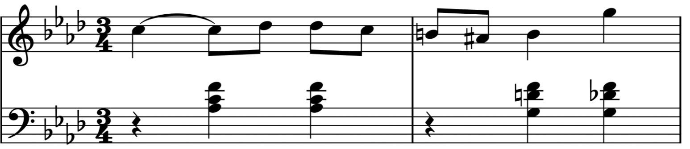
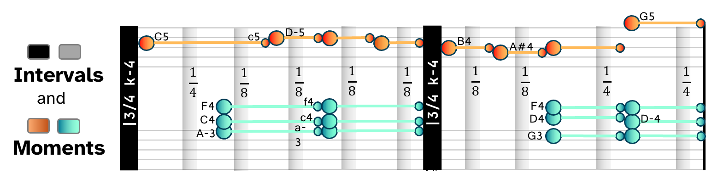
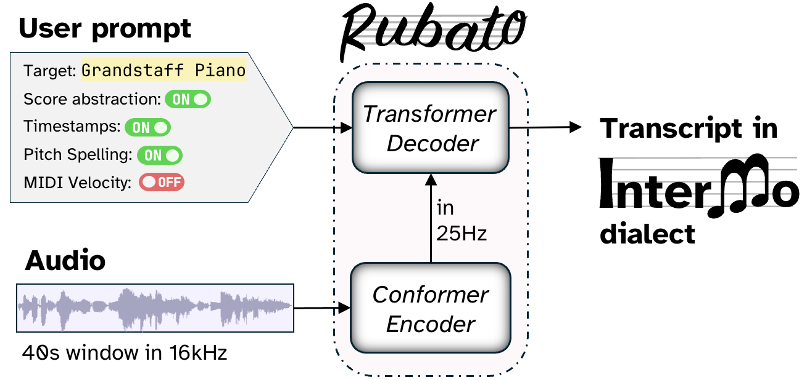

# Rubato: Transcribing Piano Music with Timestamps

The interactive demo is hosted at **https://rubato-test.pages.dev/demo**

Due to aggressive YouTube advertisement policies specifically targeting `*.github.io` domains, the demo — which synchronizes YouTube video playback with live notation rendering — has been moved to an alternative host.

## How Rubato works

**_Rubato_** is a small AI model that listens to music and writes out the score — note by note, beat by beat, synchronized to the audio.

It is powered by *InterMo*, a new music language that encodes notation and timing in a single sequence, so the AI can generate both at once.

The result: you can follow the score in sync with the recording and feel the *rubato* — the expressive timing that gives each performance its character.

### Piano transcription

Rubato is trained on piano audio. The scores you see in the demo are generated entirely from the audio signal — no human editing, no MIDI input.

### Zero-shot piano reduction

For orchestral, ensemble, and pop recordings, Rubato produces a piano reduction without any additional training on non-piano audio. It maps what it hears onto a grand staff, giving you a readable two-hand score of music it was never trained on.

---

Western staff notation is one of the most sophisticated human languages. It captures melody, rhythm, phrasing, and structure in a form musicians can read, interpret, and discuss. However, generating this abstract notation — especially in a way that would support human creative interactions with audio — has been a pain point for modern AI. Existing formats are extremely verbose for AI generation; and they force the musician to give up direct interaction with audio just to obtain the notational abstractions they can read.

**Intervals and Moments** (InterMo) merges human-readable notation and audio grounding in a single representation designed for autoregressive generation. This requires the model to decode the audio moment by moment, and enables users to follow along the sheet music and visually inspect the *rubato* — where a phrase leans forward, where it lingers, and where expressive timing reshapes the written pulse — directly against the recording.

**Rubato** is a prompt-conditioned encoder–decoder that generates InterMo sequences at different abstraction layers (time-aligned notation, performed note events, or beat/downbeat annotations). Unlike prior systems, Rubato requires no music-specific modeling: a standard speech recognition architecture, repurposed as-is, turns out to be all you need for generating readable, inspectable, audio-grounded sheet music. If the architecture doesn't distinguish speech from music, should we?

## License

Copyright (c) 2026 Rubato Authors. All rights reserved.

The interactive demo interface and its underlying source code are provided for peer review and personal evaluation only. Not for redistribution or commercial use. Open-source release for research and education to follow.
